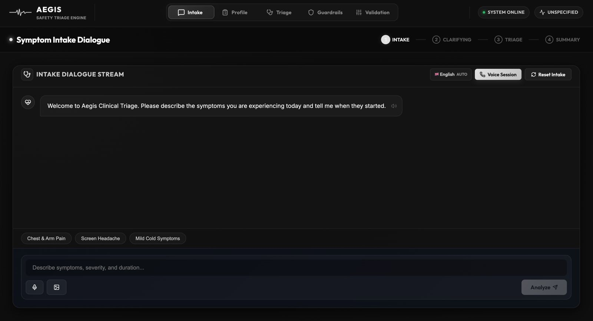
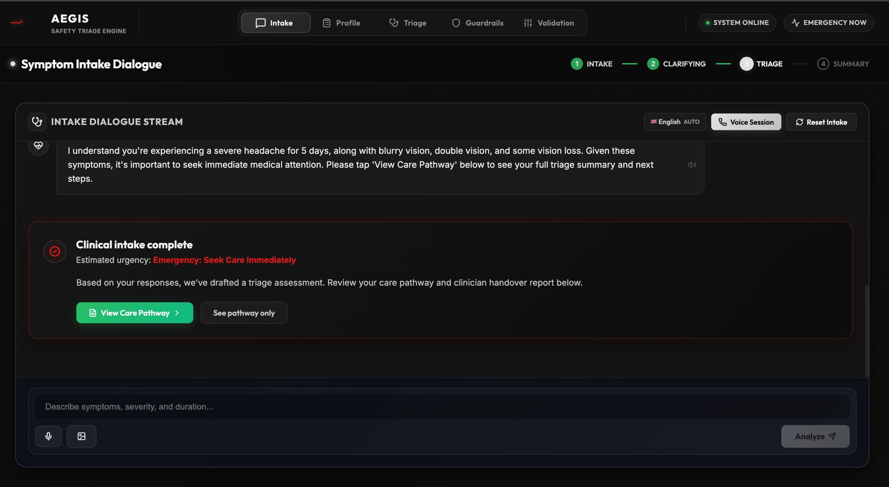
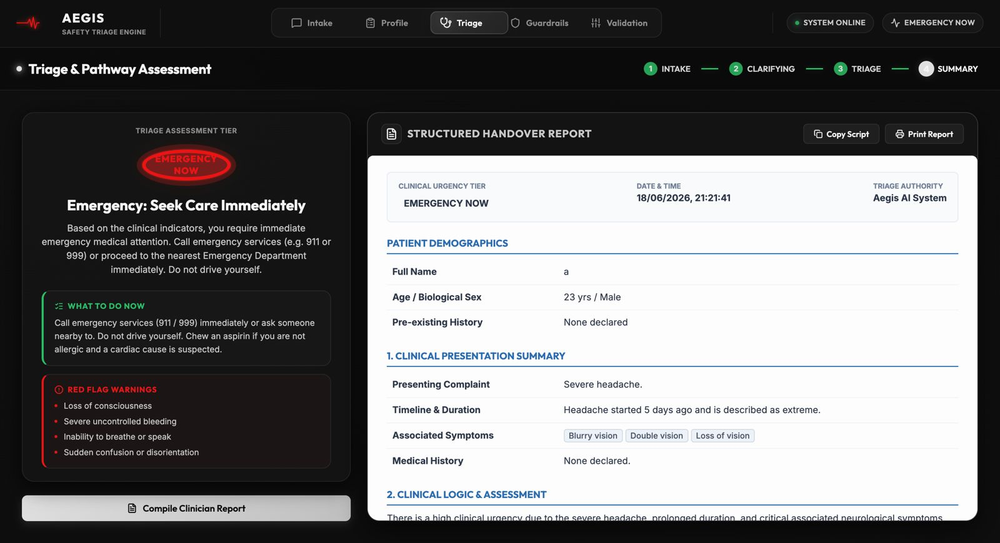

# 🏥 Aegis: AI-Powered Healthcare Triage Assistant

**Helping patients reach the right care — before they reach the waiting room.**

Aegis is an advanced, conversational AI triage assistant built to accurately stratify clinical urgency, generate comprehensive provider handover reports, and safely route patients to the correct level of care (Emergency, A&E, GP Urgent, GP Routine, or Self-Care). 

---

## 🎯 The Problem
Patients often struggle to self-triage accurately. A well-designed assistant can direct patients to the right care level, reducing inappropriate Emergency Department utilization and improving patient outcomes through rapid, accurate direction.

## 🔨 What We Built
A conversational triage assistant featuring symptom intake, adaptive red-flag hunting, precise urgency assessment, care pathway recommendations, and structured patient summaries for healthcare providers.

---

## ✨ Core Features

*   **Conversational Symptom Intake:** 
    A natural conversational interface that collects the patient's primary complaint, duration, severity, associated symptoms, and relevant history, powering a structured JSON data model underneath.
*   **Adaptive Questioning (Differential Diagnosis Logic):** 
    The AI acts like a veteran triage nurse. Instead of generic questions, it dynamically hunts for **"red flags"**. For example, if a patient reports back pain, it actively asks about leg weakness or bowel control to rule out severe emergencies like Cauda Equina Syndrome.
*   **Urgency Stratification:** 
    Classifies the case into strict tiers: `Emergency Now`, `A&E Today`, `GP Urgent`, `GP Routine`, or `Self-Care`.
*   **Care Pathway Guidance:** 
    For each urgency tier, the system provides specific, actionable guidance for the patient, including exactly what to do next, what to tell the provider, and red flag symptoms to watch for.
*   **Provider Handover Summary:** 
    Generates a structured, clinical-grade patient summary for the healthcare provider, drastically reducing intake time.
*   **Hard-Coded Safety Guardrails:** 
    The system utilizes strict, regex-based hardcoded safety logic. Certain dangerous symptom combinations (e.g., chest pain + radiating arm pain, sudden thunderclap headache, stroke FAST symptoms) bypass the AI entirely and **always** immediately route to `Emergency Now`.

---

## 🖼️ Application Overview

### Handover Report & Provider Summary

---

## 🚀 Technical Architecture & Stack

*   **Frontend:** Next.js (React), Tailwind CSS
*   **AI / LLM:** Google Cloud Vertex AI (`gemini-2.5-flash`)
*   **Voice Capabilities:** Google Cloud Speech-to-Text (STT) and Text-to-Speech (TTS)
*   **Security:** Server-side prompt injection sanitization (2000 character limits, regex strippers for jailbreak patterns).
*   **State Management:** Strict Turn-Budgeting and anti-repetition memory tracking.

## 🛡️ Safety & Anti-Repetition Mechanisms

*   **Prompt Injection Protection:** All user inputs are sanitized server-side to strip known jailbreak patterns (`ignore previous instructions`, `DAN`, etc.) before reaching the LLM.
*   **Turn Memory Lock:** The system explicitly tracks the conversation turn count and feeds an "Already Covered Topics" array to the prompt, physically preventing the AI from repeating a clinical question it has already asked.
*   **Hard Intercept Closing Phase:** Once clinical urgency is determined, the server intercepts the AI's response and enforces a clean conversation closure, preventing run-on dialogue.

---

## 💻 Getting Started

1. **Clone the repository**
2. **Install dependencies:**
   \`\`\`bash
   npm install
   \`\`\`
3. **Configure Environment Variables:**
   Add your Google Cloud Credentials and `GCP_LOCATION` to your `.env` file.
4. **Run the development server:**
   \`\`\`bash
   npm run dev
   \`\`\`
5. Open [http://localhost:3000](http://localhost:3000) in your browser.
